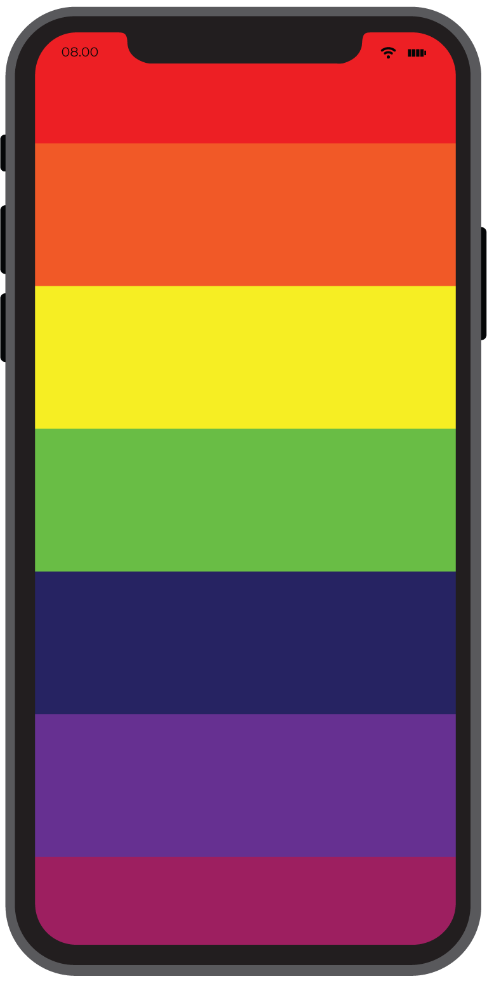

# xylophone

Basic single page moblie application that plays different nodes on different keys made for fun😄.It is made using cross platform development kit [Flutter](https://flutter.dev/).

  
  
  <h3>yes! the phone is huge cause I didn't have much to write</h3>

## Installation
Clone it in your device and use suitable IDE (Visual Studio Code, Android Studio),Run using physical device or emulator.

## Uses

tap the keys see the magic & show your talent!

## Contributing
Pull requests are welcome. For major changes, please open an issue first to discuss what you would like to change.
